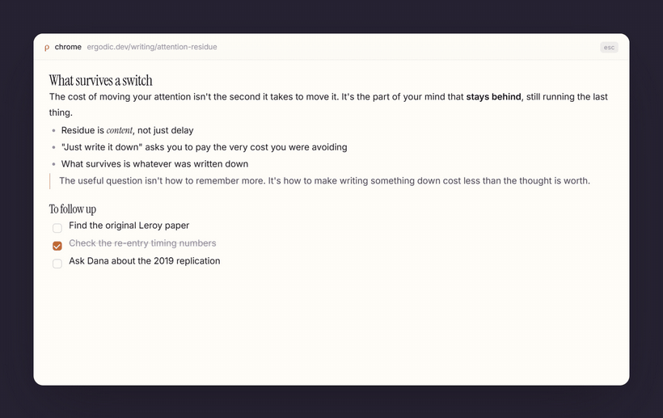
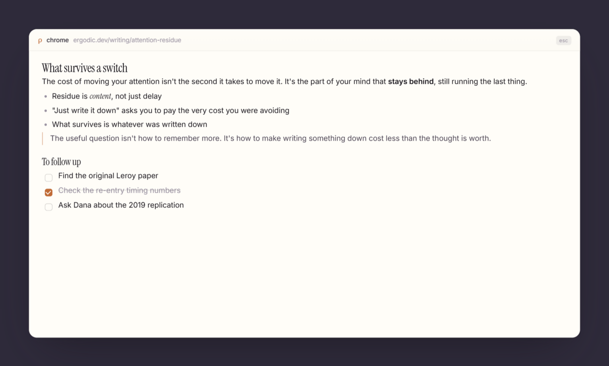
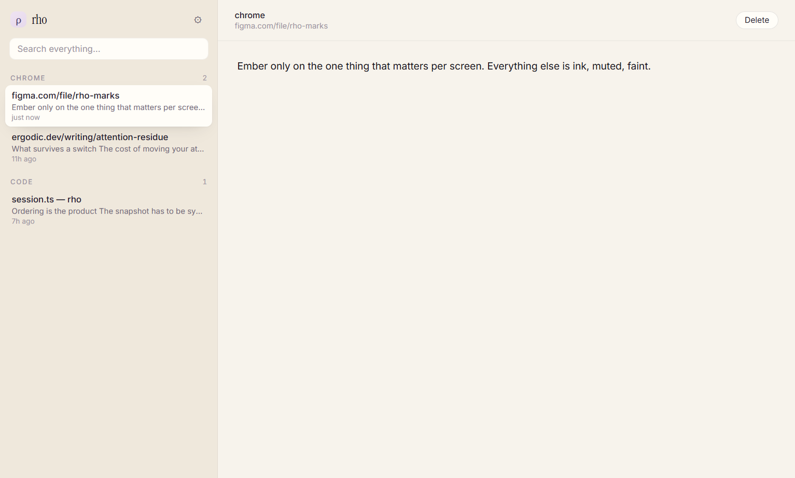

<div align="center">

# rho

**Every window has a back side.**

Press a hotkey and the window you're looking at turns over. Type on the back of
it. Press it again and you're back where you were — same tab, same page, same
half-finished sentence.

[](#install)
[](LICENSE)
[](https://electronjs.org)
[](https://rho.pranavbarthwal.in)

[Website](https://rho.pranavbarthwal.in) ·
[Install](#install) ·
[Usage](#usage) ·
[Architecture](docs/ARCHITECTURE.md)



</div>

---

## Why

The cost of writing something down isn't the writing. It's leaving the page,
finding the app, picking the note, and coming back changed. By the time you're
there, the thought has cooled and you've lost your place.

rho removes the trip. The note is already attached to what you're looking at.
Nothing opens, nothing moves — the window just has a back now.

## Features

- **One key, from anywhere.** A global hotkey turns the current window over,
  wherever you are. The editor has focus before the animation starts, so you can
  type immediately.
- **Notes stick to where you were.** Each note binds to the window it was taken
  behind — the app, the window title, and the browser URL. Come back to that tab
  tomorrow, press the key, and your note is there.
- **Markdown that behaves like Notion.** Type `## ` for a heading, `- ` for a
  bullet, `[] ` for a to-do. `/` opens a command menu. It's a real rich-text
  editor, but what lands on disk is plain markdown.
- **Your notes are files.** One `.md` per note in a folder you choose. Greppable,
  syncable, and readable by any other editor. No database, no account, no cloud.
- **A picture of where you were.** Each note keeps a screenshot of the window as
  it looked when you wrote it.
- **One library for all of it.** Every note from every window, grouped by app and
  searchable in one place.
- **Private by default.** Everything stays on your machine. The overlay is even
  excluded from screen recordings and shares.

## Install

### Download

Grab the installer from the [website](https://rho.pranavbarthwal.in) or the
[Releases](https://github.com/PranavBarthwal/rho/releases) page. Windows 10 and
11.

### Build from source

Requires [Node.js](https://nodejs.org) 20 or newer. Nothing else — no Python, no
Visual Studio build tools.

```bash
git clone https://github.com/PranavBarthwal/rho.git
cd rho
npm install
npm run dev
```

To produce an installer in `dist/`:

```bash
npm run dist
```

## Usage

Press the hotkey behind any window and start typing. Press it again — or hit
<kbd>Esc</kbd> — to put the window back. Notes save themselves as you type.

| Shortcut | Does |
|---|---|
| <kbd>Ctrl</kbd> <kbd>Alt</kbd> <kbd>Space</kbd> | Turn the window over, and back |
| <kbd>Esc</kbd> | Put the window back |
| <kbd>Ctrl</kbd> <kbd>Enter</kbd> | Same, for different muscle memory |
| <kbd>Ctrl</kbd> <kbd>Shift</kbd> <kbd>L</kbd> | Open the library |

> [!NOTE]
> If another app already owns <kbd>Ctrl</kbd> <kbd>Alt</kbd> <kbd>Space</kbd>,
> rho quietly takes the next free combination instead. The tray menu and
> Settings both show which one it actually got, and you can change it.

rho lives in the tray. Closing the library window doesn't quit it.

### Writing

Formatting happens as you type — the prefix disappears and the formatting takes
its place.

| Type | Get |
|---|---|
| `# ` `## ` `### ` | Headings |
| `- ` | Bullet list |
| `1. ` | Numbered list |
| `[] ` | To-do with a checkbox |
| `> ` | Quote |
| ` ``` ` | Code block |
| `---` | Divider |
| `**bold**` `*italic*` `` `code` `` | Inline formatting |

Type `/` at the start of a line for a menu of the same things, for when you
can't remember which prefix.



### The library



Open it from the tray, or with <kbd>Ctrl</kbd> <kbd>Shift</kbd> <kbd>L</kbd>.
Notes are grouped by the app they were written behind, and search covers
titles, addresses and note text at once. There are no folders and no tags —
you find a note by remembering where you were.

## Your notes

Everything lives in `%USERPROFILE%\rho\` by default:

```
rho/
├─ notes/2026/09/<id>.md   one markdown file per note
├─ shots/<id>.jpg          the window as it looked at the time
└─ index.json              a cache, rebuilt from the files on startup
```

The files are the source of truth. Edit them by hand, sync the folder with
OneDrive or Dropbox, put it in git — rho reconciles with whatever it finds on
startup. Point it at a different folder in Settings.

## Settings

| | |
|---|---|
| **Hotkey** | Any combination, e.g. `Control+Alt+Space` |
| **Keep a picture of the window** | The screenshot stored with each note. It's also what the flip turns over |
| **Read browser addresses** | Binds notes to a specific tab without the extension. See the caveats below |
| **Start when I sign in** | Launch rho at login |
| **Notes folder** | Where your `.md` files go |

## Browser extension (optional)

rho can tell which page you were on without any extension, by reading the
address bar through Windows accessibility. That works, but it's approximate:
what it reads is the *display* text, not the real URL, and it can't see into
app-mode windows at all.

The extension makes it exact. It's unpacked for now:

1. Open `chrome://extensions` and turn on **Developer mode**
2. **Load unpacked** → choose the `extension/` folder
3. Open the extension's options and paste the pairing token from rho's Settings

Works in Chrome and Edge. It only ever sends the active tab's URL and title, to
`127.0.0.1`, and rho rejects anything without the token.

## Privacy

rho is entirely local. There is no account, no telemetry, and nothing leaves
your machine. Notes are files in a folder you chose.

Two things worth knowing:

- Screenshots of your windows are stored alongside your notes. Turn it off in
  Settings if you'd rather not.
- Reading browser addresses switches Chrome into accessibility mode, which costs
  Chrome some memory. Turning it off falls back to keying notes by window title.

## Development

```bash
npm run dev        # run the app with hot reload
npm test           # unit tests
npm run typecheck  # main + renderer
npm run build      # typecheck and bundle
npm run dist       # NSIS installer into dist/
```

The UI can be worked on in an ordinary browser — no Electron needed:

```bash
npx vite src/renderer
```

Then open `/library/index.html` or `/overlay/index.html`. A dev-only mock stands
in for the desktop side with sample notes.

The images in this README are generated, not hand-captured — so they never
contain anything from the machine that made them. With that dev server running:

```bash
npx electron scripts/shoot.cjs    # the still screenshots
npx electron scripts/record.cjs   # the demo GIF (needs ffmpeg)
```

```
src/
├─ main/        Electron main — hotkey, Win32, capture, storage
├─ preload/     the bridge between the two
├─ renderer/    overlay window, library window, shared editor
└─ shared/      types used by both sides
extension/      the optional browser extension
docs/           architecture notes and screenshots
```

For how the flip works, why notes bind the way they do, and the measurements
behind the timings, see **[docs/ARCHITECTURE.md](docs/ARCHITECTURE.md)**.

## Status

Early access, and honest about it. The core loop — hotkey, turn, type, save,
find it again — works, but expect rough edges. Bug reports and pull requests
are welcome; [open an issue](https://github.com/PranavBarthwal/rho/issues) with
what you were doing and what happened.

Windows only. The window-turning depends on Win32 and DWM, so a Mac or Linux
port would be a rewrite of the parts that matter, not a flag.

## License

[MIT](LICENSE) © Pranav Barthwal
